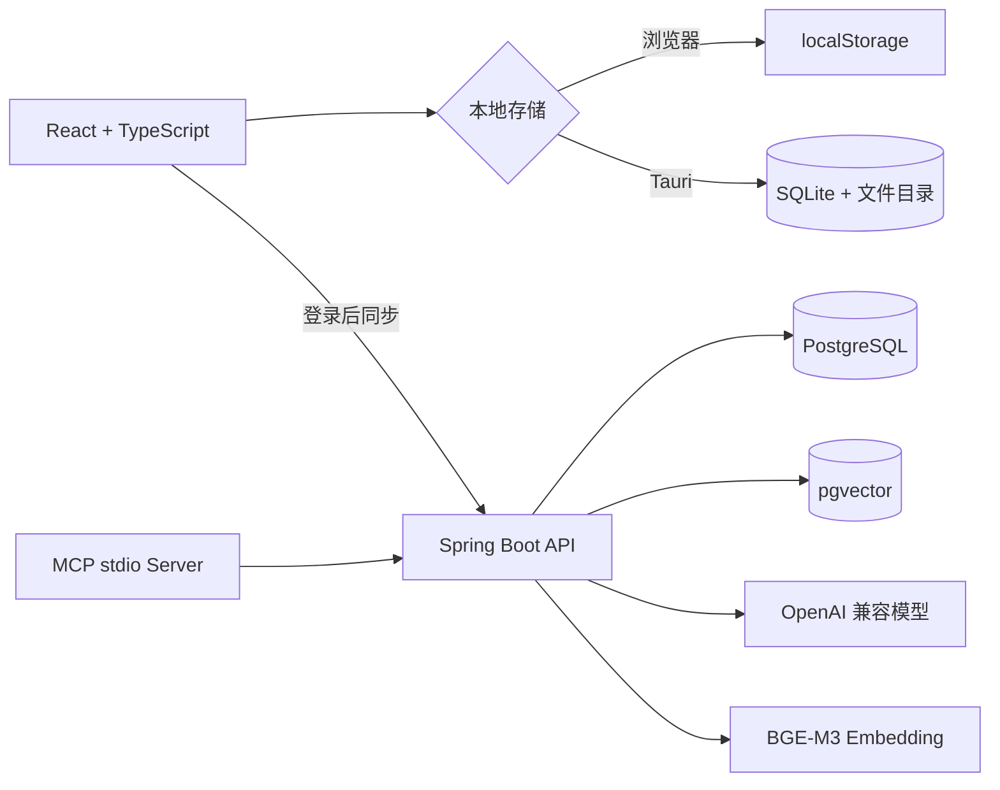

# 知序（Zhixu）

知序是一个本地优先的个人知识库与 AI 管家。它把笔记、Markdown/TXT 文件、待办、分类、收藏和分层归档统一到一个工作台中；没有后端时可以独立使用，登录后再把支持同步的数据保存到云端，并通过 RAG 检索知识内容。

当前版本：`0.1.0`，处于持续开发阶段。

## 核心能力

### 笔记与 Markdown

- 笔记始终先保存到本机，离线时仍可新建、编辑、删除和搜索。
- 使用 Vditor IR 模式实现类似 Typora 的单页即时渲染，不需要左右分栏预览。
- 支持标题、粗体、斜体、列表、表格、代码块、链接、引用和任务列表。
- 支持 `Ctrl+1` 至 `Ctrl+6` 标题、`Ctrl+M` 表格、`Ctrl+U` 代码块等快捷键。
- 离开正在编辑的笔记前，可以选择继续编辑、不保存或保存后前往目标页面。

### 内容组织

- 新笔记默认进入草稿箱，也可以放入自定义分类。
- 收藏、分类、归档和云同步是彼此独立的状态。
- 归档支持任意层级目录，例如 `2026年 / 5月 / 工作`。
- 归档只建立组织映射，不移动或复制原内容；归档后的笔记和文件仍保留在原列表中。
- 归档目录使用树形选择器，支持层级缩进、当前目录标记和键盘关闭。

### 本机知识库文件

- 支持导入、扫描、阅读和编辑 UTF-8 编码的 `.md`、`.markdown` 和 `.txt` 文件。
- Tauri 桌面端直接访问设置中的本机目录，保存时写回原文件。
- 浏览器模式使用浏览器本地存储模拟知识文件仓库，不能扫描任意 Windows 目录。
- 文件可以单独设置分类、收藏、归档和云端上传状态。
- 云端文档记录被删除时，不会删除对应的本机源文件。

### 本地优先与云同步

- Tauri 桌面端使用 SQLite 保存笔记、待办、设置、归档目录和同步队列。
- 保存操作不依赖网络；登录且存在知识空间时，客户端再重放本地同步队列。
- 支持同步中、已同步、失败和 revision 冲突状态。
- 冲突不会静默覆盖，用户可以明确选择本机版本或云端版本。

### AI 管家

- 可以配置 OpenAI 兼容服务的 URL、API Key、模型名、温度和最大输出。
- 离线账户模式从本机笔记与知识文件中选择上下文，再直接请求配置的模型。
- 登录模式由 Spring Boot 后端执行 pgvector 语义检索，再通过 LangChain4j 调用模型。
- 回答会区分本机笔记、本地文件和云端文件来源。
- 模型配置保存在当前设备，不写入 PostgreSQL。

### 应用体验

- 设置采用左侧分类、右侧内容的双栏结构，包含账号、通用、AI 模型、通知和关于。
- 外观支持跟随系统、浅色和深色模式，并作用于整个应用与 Markdown 编辑器。
- 支持桌面、手机竖屏和手机横屏布局。
- 今日待办支持添加、编辑、完成、恢复和删除。

## 运行模式

| 模式 | 本地数据 | 云端能力 | 适用场景 |
| --- | --- | --- | --- |
| 浏览器模式 | `localStorage` | 可通过 Vite 代理连接后端 | 快速开发、界面调试、手机浏览器访问 |
| Tauri 桌面模式 | SQLite + 本机文件系统 | 可选 | 日常使用、真实目录扫描、桌面安装包 |
| 登录云端模式 | 本地存储优先 | PostgreSQL、pgvector、RAG、跨设备副本 | 多设备与云端知识检索 |

浏览器存储与 Tauri SQLite 是两套独立的本地数据，当前不会自动互相迁移。

## 系统架构



数据分层：

```text
SQLite / localStorage  -> 本地笔记、待办、设置、元数据和同步队列
知识文件目录            -> Markdown/TXT 原始文件
PostgreSQL             -> 用户、空间、笔记、待办和云端文档副本
pgvector               -> 文档切块后的派生向量索引
```

## 技术栈

| 模块 | 技术 |
| --- | --- |
| 前端 | React、TypeScript、Vite、Vditor、React Markdown、Playwright |
| 桌面端 | Tauri 2、Rust、SQLite、Windows NSIS |
| 后端 | Java 17、Spring Boot 3.4、JDBC、LangChain4j |
| 数据库 | PostgreSQL、pgvector、SQLite |
| AI | OpenAI 兼容 Chat API、BGE-M3 Embedding、RAG |
| MCP | TypeScript、官方 MCP SDK、stdio transport |

## 项目结构

```text
D:\KnowledgeOrder
├─ frontend/             # React + TypeScript + Vite + Tauri 2
├─ backend/              # Spring Boot + LangChain4j + PostgreSQL
├─ mcp-server/           # 独立 MCP stdio 工具服务
├─ database/             # 桌面开发数据库目录，运行数据不提交 Git
├─ docs/                 # 架构、接口、部署和进度文档
├─ .env.example          # 后端环境变量示例
└─ README.md
```

## 环境要求

仅运行浏览器前端时只需要 Node.js。其他依赖按使用模式安装。

| 工具 | 版本或要求 | 用途 |
| --- | --- | --- |
| Node.js | `>=20.19.0 <21` | 前端与 MCP Server |
| npm | 随 Node.js 20 | 依赖与脚本 |
| Rust | stable，最低 `1.77.2` | Tauri 桌面开发 |
| Java | 17 | Spring Boot 后端 |
| Maven | 3.9+ | 后端构建与启动 |
| Docker Desktop | 可选 | 快速启动 PostgreSQL + pgvector |
| WebView2 / MSVC Build Tools | Windows Tauri 开发需要 | 桌面端编译 |

## 快速开始

### 1. 仅启动浏览器前端

这是最简单的体验方式，不需要数据库或后端。

```powershell
cd D:\KnowledgeOrder\frontend
npm install
npm run dev
```

打开 <http://localhost:5173>，点击“离线进入本地知识库”。

局域网内的手机也可以访问终端显示的 `Network` 地址。该方式适合开发调试，不应直接暴露到公网。

### 2. 启动 Tauri 桌面端

先安装 Rust、WebView2 和 Windows C++ 构建工具，然后执行：

```powershell
cd D:\KnowledgeOrder\frontend
npm install
npm run app:dev
```

构建 Windows 安装包：

```powershell
npm run app:build
```

桌面模式会使用真实 SQLite 和本机文件系统。更详细的 Windows 环境说明见 [Rust 与 Tauri 指南](docs/Rust与Tauri指南.md)。

### 3. 启动完整云端链路

先启动 PostgreSQL + pgvector：

```powershell
cd D:\KnowledgeOrder\backend
$env:POSTGRES_PASSWORD = "请替换为本地开发密码"
docker compose up -d
```

再设置后端连接参数并启动 Spring Boot：

```powershell
$env:DATABASE_PASSWORD = $env:POSTGRES_PASSWORD
$env:PGVECTOR_PASSWORD = $env:POSTGRES_PASSWORD
mvn spring-boot:run
```

检查后端：

```powershell
Invoke-RestMethod http://localhost:8080/api/health
```

最后在另一个终端启动前端：

```powershell
cd D:\KnowledgeOrder\frontend
npm run dev
```

Vite 会把 `/api` 代理到 `http://localhost:8080`。如需文档向量化和云端 RAG，还需要根据 [本地嵌入服务](docs/本地嵌入服务.md) 启动 BGE-M3 服务，并在应用设置中填写可用的 OpenAI 兼容模型。

环境变量清单见 [.env.example](.env.example) 和 [参数台账](docs/参数台账.md)。不要把真实密码或 API Key 提交到仓库。

## 常用命令

### 前端

```powershell
cd frontend
npm run dev          # Vite 开发服务器，端口 5173
npm run app:dev      # Tauri 桌面开发
npm run lint         # ESLint
npm run build        # TypeScript + Vite 生产构建
npm run test:e2e     # Playwright 完整回归
npm run app:build    # 构建桌面安装包
```

### 后端

```powershell
cd backend
mvn test
mvn spring-boot:run
mvn package
```

### MCP Server

```powershell
cd mcp-server
npm install
npm run build
npm start
```

MCP Server 使用 stdio，不监听额外端口。它只通过受控 HTTP API 调用后端，不直接连接 PostgreSQL。当前 MCP 工具尚未接入应用内 AI 对话链路，具体状态见 [mcp-server/README.md](mcp-server/README.md)。

## 默认端口

| 服务 | 端口 |
| --- | ---: |
| Vite 前端 | `5173` |
| Vite Preview / Playwright | `4173` |
| Spring Boot 后端 | `8080` |
| BGE-M3 Embedding | `8100` |
| PostgreSQL + pgvector | `5432` |
| MCP Server | stdio，无端口 |

## 本地数据位置

Tauri 开发环境默认数据库：

```text
D:\KnowledgeOrder\database\zhixu.db
```

安装版优先使用安装目录下的 `database\zhixu.db`；目录不可写时回退到：

```text
%APPDATA%\com.zhixu.desktop\zhixu.db
```

知识库文件保存在设置指定的目录中，默认目录标识为 `knowledge-files`。删除知识文件的云端文档记录或归档映射，不等同于删除本机源文件。

## 测试与质量检查

前端回归覆盖桌面、手机竖屏和手机横屏，包括：

- 离线笔记、待办、分类和个人资料。
- Markdown 即时渲染与快捷键。
- 分层归档和原内容保留语义。
- 知识文件导入、编辑和状态管理。
- 编辑器离开前保存确认。
- 浅色、深色和跟随系统外观。
- 登录、同步、空间、AI 与云端接口联调。

提交前建议执行：

```powershell
cd frontend
npm run lint
npm run build
npm run test:e2e -- --workers=1

cd ..\backend
mvn test
```

## 当前限制

- 知识文件目前主要支持 Markdown 和 TXT，PDF、DOCX 等解析器尚未接入。
- 云同步仍由客户端逐条重放，完整的跨设备增量游标与批量 push/pull 尚未完成。
- 云端原文件仍保存在服务器本地目录，尚未切换到 MinIO/S3。
- 模型 API Key 保存在本机 SQLite 或 `localStorage`，尚未接入系统凭据保险库。
- MCP 尚未接入当前应用内 AI 对话链路。
- 手机端是响应式浏览器界面，不是 Android/iOS 原生安装包，也没有 PWA 离线启动缓存。

## 文档导航

- [文档中心](docs/README.md)
- [现有功能说明](docs/现有功能说明.md)
- [整体架构](docs/整体架构.md)
- [部署方案](docs/部署方案.md)
- [数据与文件策略](docs/数据与文件策略.md)
- [前后端接口契约](docs/前后端接口契约.md)
- [数据库配置](docs/数据库配置.md)
- [参数台账](docs/参数台账.md)
- [项目进度](docs/项目进度.md)
- [前端说明](frontend/README.md)
- [MCP Server 说明](mcp-server/README.md)
